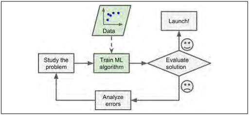
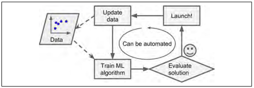
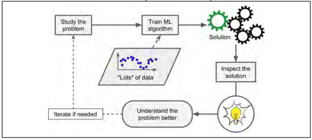
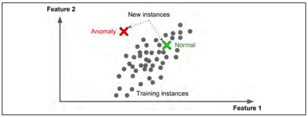

# Part I. 机器学习基础

## Chapter 1.机器学习现状

当大多数人听到 “机器学习” 的时候，他们会描绘一个机器人：一个可靠的管家或者一个致命的终结者，这取决于你所问的对象。 但机器学习不只是一个未来的幻想，它已经体现在了生活中的方方面面。 事实上，在一些专门的应用中，如光学字符识别（OCR）已经有数十年的历史了。 但是，第一个真正成为主流的并改善了数亿人的生活，在 20 世纪 90 年代接管了世界的 ML 应用程序：它是垃圾邮件过滤器。确切上说，它不完全是一个自我认识的天网，但它在技术上符合机器学习（实际上它已经学得很好，你很少需要将邮件标记为垃圾邮件了）。 接下来是数百个 ML 应用程序，现在悄悄地为您经常使用的数百种产品和功能提供支持，比如说，从（搜索或者购物的）更好的建议方面到语音搜索方面，都有了 ML 的涉及。

那么机器学习是从哪儿开始，又到哪儿结束呢？对于一个机器来说，它学习一些东西到底意味着什么呢？如果我下载了一份维基百科的副本，那么是不是我的电脑就真的 “学到” 了一些东西？是不是它突然变聪明了呢？在本章节中，我们将首先介绍什么是机器学习，以及为什么您可能需要使用它。

紧接着，在我们开始探索机器学习大陆之前，我们需要看一下地图，了解一下主要地区和最显著的地标：监督学习和无监督学习，在线与批量学习，基于实例与基于模型学习。然后，我们将看一个典型的 ML 项目的工作流程，讨论您可能面临的主要挑战，以及如何评估和调整机器学习系统。

本章介绍了每个数据科学家应该知道的许多基本概念（和一些行话）。这将是一个高层次的概述（唯一没有太多代码的章节），所以这些都比较简单，但是在继续阅读本书的其余部分之前，您应该确保一切都比较清楚了。所以，拿起一杯咖啡，我们开始吧！

* tips：如果您已经了解了所有的机器学习基础知识，您可以直接跳转到第 2 章。如果您不是那么确定，在跳转之前，尝试回答一下本章最后列出的所有的练习题。

### 1、机器学习是什么？

机器学习是计算机编程的科学（和艺术），所以这使得计算机可以从数据中学习。

下面给出一个更为广泛的定义：【机器学习是】 不需要一个明确的程序设计，而使得计算机能够学习的一个研究领域。 —— Arthur Samuel, 1959

一个更加面向工程的定义：如果一个计算机在任务 T 上的性能由 P 度量，并且随着经验 E 的提升而提升，那么我们就可以说这个计算机程序在任务 T 上使用 P 度量指标从经验 E 中学习。 —— Tom Mitchell, 1997

例如，您的垃圾邮件过滤器是一个机器学习程序，可以通过给出的垃圾邮件样本（例如，由用户标记）以及常规邮件样本（非垃圾邮件，也称为 "ham"）来学习标记垃圾邮件。系统用来学习的示例样本被称为训练集。每个训练示例被称为训练实例（或样本）。在这种情况下，任务 T 是为新的电子邮件标记垃圾邮件，经验 E 是训练数据，并且需要定义性能度量 P ；例如，您可以使用正确分类的电子邮件的比例。这种特殊的性能度量被称为准确性，经常用于分类任务。

如果您正好下载了一个维基百科的副本，你的电脑有很多的数据，但是在任何任务中都没有表现出突然变好的情况。所以，这个不是机器学习。

### 2、为什么使用机器学习？

考虑一下如何使用传统的编程技术来编写垃圾邮件过滤器（图 1-1）：

1. 首先你会了解一下垃圾邮件通常是什么样子的。你可能会注意到一些词或短语（比如：“为您”， “信用卡”， “免费” 和 “震惊”）往往会在这个问题上出现很多次。也许你还会注意到发件人姓名，电子邮件正文等其他一些模式。

2. 你会为你注意到的每一个模式写一个检测算法，如果检测到这些模式中的一些，你的程序将会把邮件标记为垃圾邮件。

3. 你会测试你的程序，并重复步骤 1 和步骤 2 ，直到它达到足够好的程度。

  
图1-1. 传统方法

由于这个问题并不是很小，你的程序可能会发展为一个复杂的规则很长的列表 —— 这很难维护。

相比之下，基于机器学习技术的垃圾邮件过滤器通过检测垃圾邮件示例中异常频繁的单词模式，与正常邮件示例（图1-2），自动获悉哪些单词和短语是垃圾邮件的良好预测。这个程序更加短，更加容易维护，而且很可能更加准确。

  
图1-2. 机器学习方法

此外，如果垃圾邮件发送者注意到他们所有包含 “4U” 的电子邮件都被阻止，他们可能会开始使用 “For U” 来替换。使用传统编程技术的垃圾邮件过滤器需要更新以标记 “For U” 电子邮件。如果垃圾邮件发送者继续围绕您的垃圾邮件过滤器工作，那么您需要不断写入新的规则。

相比之下，基于机器学习技术的垃圾邮件过滤器会自动注意到 “For U” 在用户标记的垃圾邮件中变得异常频繁，并且在没有您干预的情况下开始对其进行标记（图 1-3）。

  
图1-3. 自动适应变化

机器学习的另一个大放光芒的领域是针对传统方法过于复杂或者没有已知算法的问题。例如，考虑语音识别：假如你想简单地开始写一个能区分单词 “one” 和 “two” 的程序。你可能会注意到 “two” 这个单词开头是一个高音 （“T”），所以你可以硬编码一个测量高音强度的算法，并用它来区分 “one” 和 “two” 。很明显，这种技术不会在嘈杂的环境和数十种语言中扩展成千上万非常不同的人所说的话。最好的解决方案（至少是现在最好的）是编写一个自学习的算法，给出每个单词的许多示例记录。

最后，机器学习可以帮助人类学系（图 1-4）：可以检查 ML 算法，看看他们已经学到了什么（尽管对于一些算法来说这可能很困难）。例如，一旦垃圾邮件过滤器已经接受足够的垃圾邮件训练，就可以很容易地检查垃圾邮件过滤器是否能够预测垃圾邮件的最佳预测效果。有时候，这将揭示出未知的相关性或新的趋势，从而导致对问题有更好的理解。应用 ML 技术挖掘大量的数据可以帮助发现那些并不明显的模式。这被称为数据挖掘。

  
图1-4. 机器学习可以帮助人类学习

总而言之，机器学习对于以下的问题都有较好的表现：

 - 现有解决方案需要大量手动调整或长规则列表的问题：一种机器学习算法通常可以简化代码并且得到更好的效果。

 - 使用传统的方法没有好的解决方案的复杂的问题：最好的机器学习技术可以找到一个解决方案。

 - 不是很稳定，时常波动的环境：机器学习系统可以适应新的数据。

 - 需要深入了解复杂的问题和数据量比较大的问题。

 ### 3、机器学习系统的类型

 有很多不同类型的机器学习系统，根据下面的类别对它们进行分类是非常有用的：

 - 它们是否接受人工监督（有监督，无监督，半监督和强化学习）

 - 它们是否可以即时增量学习（在线 vs 批量学习）

 - 无论它们是通过将新数据点与已知数据点进行简单比较，还是像科学家一样，检测训练数据中的模式并构建预测模型（基于实例的学习 与 基于模型的学习）

 这些标准不是唯一的；你可以用任何你喜欢的方式把它们组合起来。例如，一个最先进的垃圾邮件过滤器可以使用通过垃圾邮件和常规邮件的例子进行训练的神经网络模型进行实时学习；这使得它成为一个在线的，基于模型的监督式学习系统。
 
 接下来，让我们来深入了解一下这些标准。

 #### 3.1、有监督/无监督 学习

 机器学习系统可根据他们在训练期间获得的监督（有 label 的样本）的数量和类型进行分类。有四个主要类别：监督学习，无监督学习，半监督学习和强化学习。

 ##### 3.1.1、监督学习

 在监督学习中，您提供给算法的训练数据包括所需的解决方案，称为 labels（标签）（图 1-5）

   
图1-5. 有监督学习的标记训练集（例如，垃圾邮件分类）

典型的监督学习任务是分类。垃圾邮件过滤器就是一个很好的例子：它是与许多示例电子邮件和它们的类（垃圾邮件和常规邮件）一起训练，并且它必须学会如何分类新的电子邮件。

另一个典型的任务是预测一个目标数值，如给定一组特征（里程，年限，品牌等），来预测一辆汽车的价格，称为预测。这种任务被称为回归（图 1-6）。为了训练这个系统，你需要给出很多汽车的样本，包括他们的预测指标（前面提到的特征）和对应的 label（即它们的价格）。

* Tips：有趣的是，“回归”这个奇怪的名字是 Francis Galton 在研究高个子父母的孩子往往比父母要矮的事实时所引入的统计学术语。由于孩子较矮，他把这种回归称为平均。然后将这个名称应用于他用来分析变量之间相关性的方法。

* Tips：在机器学习中，属性是数据类型（例如，“里程”），而特征取决于上下文具有多个含义，但通常意味着属性加上其值（例如，“里程 = 15000”）。尽管如此，许多人可以互换地使用单词属性和特征。

   
图1-6. 回归

请注意，一些回归算法也可以用于分类，反之亦然。例如，Logistic 回归通常用于分类，因为它可以输出与属于给定类别的可能性相对应的值（例如，20% 的可能性是垃圾邮件）。

下面列出了一些最重要的监督学习算法（本书所涵盖）：

 - k-Nearest Neighbors（k近邻）
 - Linear Regression（线性回归）
 - Logistic Regression（Logistic 回归）
 - Support Vector Machines (SVMs)（支持向量机）
 - Decision Trees and Random Forests（决策树和随机森林）
 - Neural network（神经网络）

Tips：一些神经网络架构可以是无监督的，比如自动编码器和受限制的玻尔兹曼机。他们也可以是半监督的，比如深度信仰网络和无监督的预训练。

##### 3.2、无监督学习

在无监督学习，你可能会猜到，训练数据是没有标签的（图 1-7）。该系统试图在没有人工监督的情况下进行学习。

   
图1-7. 一个无标记的训练集用于无监督学习

下面介绍一些最重要的无监督学习算法（我们将在第 8 章介绍降维）：

 - 聚类
    - k-Means
    - Hierarchical Cluster Analysis (HCA)（分层聚类分析）
    - Expectation Maximization（期望最大化）

 - 可视化和降维
    - Principal Component Analysis (PCA)（主成分分析）
    - Kernel PCA— Locally-Linear Embedding (LLE)（内核 PCA - 局部线性嵌入）
    - t-distributed Stochastic Neighbor Embedding (t-SNE)（t 分布的随机相邻嵌入）

 - 关联规则学习
    - Apriori
    - Eclat

例如，假设您有大量关于博客访问者的数据。您可能需要运行一个聚类算法来尝试检测相似访问者组（图 1-8）。你不需要告知算法博客访问者属于哪个组：它发现这里没有你的帮助。例如，可能会注意到，有 40% 的访问者是喜欢漫画的男性，一般在晚上阅读您的博客， 20% 是周末访问的年轻科幻爱好者，等等。如果使用层次聚类算法，那么也可以将每个组细分为更小的组。这可能会帮助您定位每个组的类别。

   
图1-8. 聚类

可视化算法也是无监督学习算法的一个好例子：您向它们提供大量复杂和未标记的数据，并输出数据的 2D 或 3D 表示形式（图 1-9）。这些算法试图保留尽可能多的结构（例如，试图在输入空间中保持独立的聚类在可视化中不重叠），这样就可以理解数据是如何组织的，并且可能识别不确定的模式。

   
图1-9. 突显语义聚类的 t-SNE 可视化示例

 - Tips：注意一下动物与车辆的分离程度，马距离鹿比较近但是距离鸟比较远等等。经过 Socher, Ganjoo, Manning, and Ng (2013) 的许可转载，“T-SNE visualization of the semantic word space.” 

一个相关的任务是降维，其目标是简化数据而不会丢失太多的信息。一种方法是将几个相关的特征合并为一个。例如，汽车的里程数可能与其年限非常有关系，因此降维算法将把它们合并成一个代表汽车磨损的特征。这被称为特征提取。

在将其提供给另一个机器学习算法（如监督学习算法）之前，尝试使用降维算法来减少训练数据的维数通常是一个好主意。它将运行得更快，数据将占用更少的磁盘和内存空间，在某些情况下，性能可能会更好。

另一个重要的无监督任务是异常检测 —— 例如，检测异常信用卡交易以防止欺诈，捕捉制造缺陷，或者在将数据提供给另一个学习算法之前自动移除离群值。系统是用正常的实例训练的，当它看到一个新的实例时，它可以告诉它是否看起来像一个正常的实例，或者是否可能是一个异常（见图 1-10）。

  
图1-10. 异常值检测

最后，另一个常见的无监督任务是关联规则学习，其目的是挖掘大量数据并发现属性之间的有趣关系。例如，假如你拥有一家超市。在销售日志上运行关联规则可能会发现购买烧烤酱和薯片的人也倾向于购买牛排。因此，您可能希望将这些物品放在一起。

##### 3.3、半监督学习

一些算法可以处理部分标记的训练数据，通常是很多未标记的数据和一些标记的数据。这被称为半监督学习（图 1-11）。

一些照片托管服务，例如 Google 照片就是很好的例子。一旦您将所有家庭照片上传到服务中，它会自动识别出同一个人 A 出现在照片 1,5 和 11 中，而另一个人 B 出现在照片 2,5 和 7 中。这是算法的无监督部分（聚类）。现在所有的系统需求都是为了告诉你这些人是谁。每个人只有一个标签，并且能够在每张照片中命名每个人，这对于搜索照片是有用的。

  
图1-11. 半监督学习

大多数半监督学习算法是无监督和监督算法的组合。例如， deep belief networks (DBNs)（深度信念网络）基于被称为 restricted Boltzmann machines (RBMs)（受限玻尔兹曼机）的无监督组件。以无监督的方式按顺序训练 RBM ，然后使用监督学习技术对整个系统进行微调。

* 每个人只有一个标签，那是系统完美运行的时候。在实践中，每个人往往会创建几个聚类，有时会混合两个看起来相似的人，所以您需要为每个人提供一些标签并手动清理某些聚类簇。

##### 3.4、强化学习

强化学习是一个非常不同的黑马。在这种情况下，被称为 agent 的学习系统可以观察环境，选择和执行行动，并获取回报（或负面回报的惩罚，如图 1-12）。然后，它必须自己学习什么是最好的策略，称为 policy ，以获取最大的回报。一项 policy 规定了 agent 在特定情况下应该选择的行动。

  
图1-12. 强化学习

例如，许多机器人使用强化学习算法来学习如何走路。DeepMind 的 AlphaGo 程序也是强化学习的一个很好的例子：它在 2016 年 3 月成为头条新闻，当时它在 Go 的比赛中击败了世界冠军 Lee Sedol 。它通过分析数以百万计的游戏来学习它的获胜 policy ，然后与自己玩很多游戏。请注意，在对抗冠军的比赛中，学习被关闭； AlphaGo 只是应用了它所学的 policy 。

#### 4、批量和在线学习

用来对机器学习系统进行分类的另一个标准是系统是否可以从输入数据流中递增的学习。

##### 4.1、批量学习

在批量学习中，系统无法增量学习：必须使用所有可用的数据进行训练。这通常会花费大量的时间和计算资源，所以通常是离线的。首先，系统经过训练，然后投入生产，不再学习；它只是应用了它学到的东西。这就是所谓的离线学习。

如果您希望批量学习系统去了解新数据（例如新型垃圾邮件），则需要在整个数据集上从头开始训练新版本的系统（不仅包括新数据，还包括旧数据），然后停止旧的系统，并用新的替换它。

幸运的是，训练，评估和启动机器学习系统的整个过程可以很容易地自动化（如图 1-13 所示），所以即使是批量学习系统也能适应变化。只需根据需要随时更新数据并从头开始训练新版本的系统。

这个解决方案很简单，通常工作正常，但使用全套数据进行训练可能需要很多小时，所以通常每 24 小时甚至每周训练一个新系统。如果您的系统需要适应快速变化的数据（例如预测股票价格），那么您需要一个更为反应迅速的解决方案。

而且，对整套数据进行训练需要大量的计算资源（CPU，内存空间，磁盘空间，磁盘 I/O， 网络 I/O 等）。如果你有大量的数据，而且你的系统每天都从头开始自动化，那么最终会花费你很多钱。如果数据量很大，甚至可能不可能使用批量学习算法。

最后，如果你的系统需要自主学习，资源有限（如 Mars 上的智能手机应用程序或漫游者），那么随身携带大量的训练数据，占用大量资源，每天训练几个小时就是一个不争的事实。

幸运的是，在所有这些情况下，更好的选择是使用能够增量学习的算法。

##### 4.2、在线学习

在在线学习中，通过按顺序向数据实例提供数据，逐个地或通过称为小批量的小组对其进行训练。每个学习步骤都快速且便宜，因此系统可以实时地从新数据中学习（见图 1-13）。

  
图1-13. 在线学习

在线学习对于以连续流（例如股票价格）接收数据并需要适应快速或自主变化的系统而言是非常好的。如果您拥有有限的计算资源，这也是一个不错的选择：一旦在线学习系统学习了新的数据实例，就不再需要它们了，所以您可以放弃它们（除非您希望能够回滚到之前状态和“重放”数据）。这可以节省大量的空间。

在线学习算法也可以用来训练大型数据集上的系统，这些数据集不能放在一台机器的主内存中（这被称为核外学习）。该算法加载部分数据，对该数据运行训练步骤，并重复该过程，直到它运行在所有的数据上（请参见 图 1-14）。